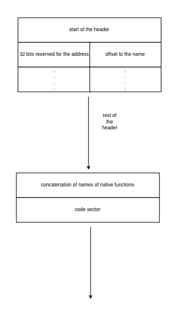

# P(A)WN
The challenge provided me with the full docker-compose setup for the challenge server and a `README.txt` with a list of instructions to download the source code and compile the pawn programming language.

# finding an attack vector
The pawn programming language is a c-like scripting language, which is compiled to `.amx` bytecode, which is then interpreted by the amx runtime, consisting out of a vm with custom registers(two general purpose registers `pri` and `alt` and some other registers like the code instruction pointer `cip`) and a custom set of opcodes.

The goal was it to get shell access on the server, which you can send any base64 encoded `.amx` file to execute it using `pawnrun` 

Because of the huge codebase, the first thing I tried to do was to use a fuzzer to find possible attack vect[]()ors.

After starting up the fuzzer I noticed an unusually high amount of unique crashes in the first few seconds, so I stopped the fuzzer and looked at the outputs. I noticed that most of the crashes are results from failed assertions, which get counted as crashes to, because assert will send the `SIGABRT` signal.

Because I ran the fuzzer on a tempfs on my local machine, I was a bit scared of flooding my RAM with crashes I could not use anyway, which, in hindsight, was a bit of an overreaction looking at the fact that there are about 580 assertions in the whole codebase, resulting in only about 580 useless crashes, I could easily sort out by looking at the exit code of the crash contained in the filename of the resulting crash file. Anyways, to be able to sort these crashes out, I used  `sed` to replace the assertions with `if(!(statement))exit(0);`:
```
sed -i 's/^\s*assert(\(.*\));\(.*\)$/if(!(\1)) exit(0);\2/' amx/*
```
After doing this, the output of the fuzzer looked much more realistic. After around 20 minutes of running the fuzzer on 10 cores, it found over 400 unique crashes.

While looking through them a bit I found a `rip` overwrite which looked quite promising.

After closer inspection of the source code and a bit of debugging, I found out that the opcode `OP_SYSREQ` is causing the jump to the invalid instruction pointer. The reason for this behaviour is the fact that the amx runtime is using native functions, which in fact are wrappers for some of the libc library functions like `printf`, `open` and others to interact with the terminal and other parts of the os. At the start of the execution, the amx runtime loads the whole `.amx` file into the heap. The header of this file format contains a array of 64 bit entries representing the native functions used by the script. The second 32 bit contain an offset to the name of the function which is also stored in the header whereas the first 32 bit the runtime fills with the address of the wrapper function (on 64 bit execution it fills the 32 bit containing the string offset with the other 32 bit of the address) after looking up the string in a dictionary containing the name and the function address. 


```c
/* example dictionary of native function names and their corresponding c function*/
const AMX_NATIVE_INFO console_Natives[] = {
	{ "getchar", n_getchar },
	{ "getstring", n_getstring },
	{ "getvalue", n_getvalue },
	{ "print", n_print },
	{ "printf", n_printf },
	{ "clrscr", n_clrscr },
	{ "clreol", n_clreol },
	{ "gotoxy", n_gotoxy },
	{ "wherexy", n_wherexy },
	{ "setattr", n_setattr },
	{ "console", n_console },
	{ "consctrl", n_consctrl },
	{ NULL, NULL } /* terminator */
};
```

```c
/*amx is a struct containing all of the basic information about the current runtime,
it is used as a parameter for almost every function*/
int AMXAPI amx_Register(AMX *amx, const AMX_NATIVE_INFO *list, int number){
	AMX_FUNCSTUB *func; /*pointer to the current entry in the native function list*/
	AMX_HEADER *hdr; /*pointer to the file in the heap*/
	int i,numnatives,err;
	AMX_NATIVE funcptr;

	hdr=(AMX_HEADER *)amx->base;

	/*a bunch of assertions*/

	numnatives=NUMENTRIES(hdr,natives,libraries);
	/*get number of entries*/

	err=AMX_ERR_NONE;

	func=GETENTRY(hdr,natives,0);

	for (i=0; i<numnatives; i++) { /*loop through all native functions*/
		if (func->address==0) { /*check if address is already located*/
			funcptr=findfunction(GETENTRYNAME(hdr,func),list,number);
			/*read out function name and look it up in 'list'*/
			if (funcptr!=NULL) {
				func->address=(uint32_t)(intptr_t)funcptr;
				
	#if defined _I64_MAX || defined __x86_64__ || defined HAVE_I64
	/* for 64-bit version the high part of the pointer must be stored too */
				func->nameofs=(uint32_t)((intptr_t)funcptr >> 32);
	#endif
	
			} else {
				err=AMX_ERR_NOTFOUND;
			}
		}
		func=(AMX_FUNCSTUB*)((unsigned char*)func+hdr->defsize); 
		/*move pointer to next entry*/
	} /* for */

	if (err==AMX_ERR_NONE)

	amx->flags|=AMX_FLAG_NTVREG;

	return err;

}

```
In the execution of the program it stores the opcode `OP_SYSREQ` together with a number, indicating the index of the address in this array.

The fuzzer only noticed the bug, because the runtime does not insert the address, if the 32 bit reserved for the address are not null, because in a normal `.amx` script, it would only have been replaced by something else, if the function was already registered earlier, resulting in a flawed address, if the binary already contains something else than 0 at the start of execution. 

While control over rip was a great success, `pawnrun` still used 64 bit mode and had ASLR enabled, resulting in a need for OOB read/write to change these addresses at runtime after calculating the address of functions I wanted to call. Luckily for me, `.amx` files contain a `data` section at the end of the file. The runtime stores the start of the data section of the binary in the pointer also named `data`, which, together with multiple opcodes to load/store values from/at the address pointed by `data` + a given offset, results in an easy way to get OOB access by using the opcodes with offsets pointing outside of the `data` section. While the runtime does checks to prevent this kind of behaviour, for static offsets, it only checks for invalid offsets at the start of the execution and only inside of the `code` section of the binary, which I easily could bypass by jumping into the `data` section of the binary immediatly, because the runtime has no read/write/execute restrictions on specific sections, resulting in the ability to write self modifying code and through that OOB read/write by overwriting static offsets inside of the code.

After jumping into the `data` section, I was able to read the address of the function `n_printf` from the address of the loaded native functions. By adding the offset `0x207dc3` I was able to calculate the address of the `got` entry of the `signal` function, which I knew was already replaced with the libc address of the function, because of a call to `signal` early on in the runtime. By reading this address i was able to break the ASLR of libc. I was able to calculate the address of all of the libc functions and was also able to write these addresses into the addresses of the native functions resulting in these libc functions being called instead of the real native functions.

At this point I thought I got all I need to pwn the docker container, but after trying to write an exploit I noticed that I do not control the arguments for the libc functions, because the runtime first calls the function `amx->callback` like this:
```c
case OP_SYSREQ:
	GETPARAM(offs);
	amx->cip=(cell)((unsigned char *)cip-amx->code);
	amx->hea=hea;
	amx->frm=frm;
	amx->stk=stk;
	i=amx->callback(amx,offs,&pri,(cell *)(data+(int)stk));
	...
```
which internally does checks on the amx object, reads out the function address from the image in memory and calls the resulting function like this:
```c
/*some checks + loading the address into f*/
amx->error=AMX_ERR_NONE;
*result = f(amx,params);
return amx->error;
```
meaning it will always get a pointer to the amx object as the first argument, which I could not overwrite with a pointer to `/bin/sh`, or could I? After looking through the amx source code and eventually finding the definition of the `tagAMX` structure I found out, that it saves the base address of the memory image on the heap in the first 8 bytes, and the address of the callback function at offset 24. 
```c
typedef struct tagAMX {
	unsigned char _FAR *base; /* points to the AMX header, perhaps followed by P-code and data */
	unsigned char _FAR *code; /* points to P-code block, possibly in ROM or in an overlay pool */
	unsigned char _FAR *data; /* points to separate data+stack+heap, may be NULL */
	AMX_CALLBACK callback; /* native function callback */
	AMX_DEBUG debug; /* debug callback */
	AMX_OVERLAY overlay; /* overlay reader callback */
	/* for external functions a few registers must be accessible from the outside */
	cell cip; /* instruction pointer: relative to base + amxhdr->cod */
	cell frm; /* stack frame base: relative to base + amxhdr->dat */
	cell hea; /* top of the heap: relative to base + amxhdr->dat */
	cell hlw; /* bottom of the heap: relative to base + amxhdr->dat */
	cell stk; /* stack pointer: relative to base + amxhdr->dat */
	cell stp; /* top of the stack: relative to base + amxhdr->dat */
	int flags; /* current status, see amx_Flags() */
	/* user data */
#if AMX_USERNUM > 0
	long usertags[AMX_USERNUM];
	void _FAR *userdata[AMX_USERNUM];
#endif
	/* native functions can raise an error */
	int error;
	/* passing parameters requires a "count" field */
	int paramcount;
	/* the sleep opcode needs to store the full AMX status */
	cell pri;
	cell alt;
	cell reset_stk;
	cell reset_hea;
	/* extra fields for increased performance */
	cell sysreq_d; /* relocated address/value for the SYSREQ.D opcode */
	int ovl_index; /* current overlay index */
	long codesize; /* size of the overlay, or estimated memory footprint of the native code */
} PACKED AMX;
```
Using this knowledge and the gets function, I was able to overwrite the base address with the string `/bin/sh\x00`, fill the following bytes with null bytes and write any function address I wanted to `amx->callback`. I used the native function `printf` to print the address of the system function by pushing the two 32 bit parts of it on the internal stack of the `amx` language and printing the string `%d%d`. I then could read out the system address, overwrite the function `amx->callback` with `system` and was able to execute `system("/bin/sh");` by calling any native function, resulting in a shell on the docker with which I was easily able to read out the flag.

`CSCG{you_ar3_a_gre34t_p(a)wner_ind33d}`
