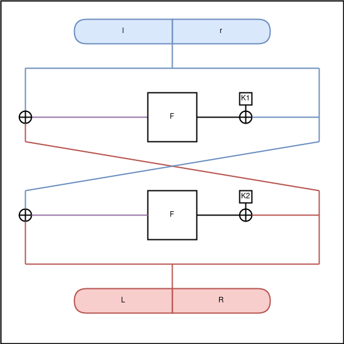
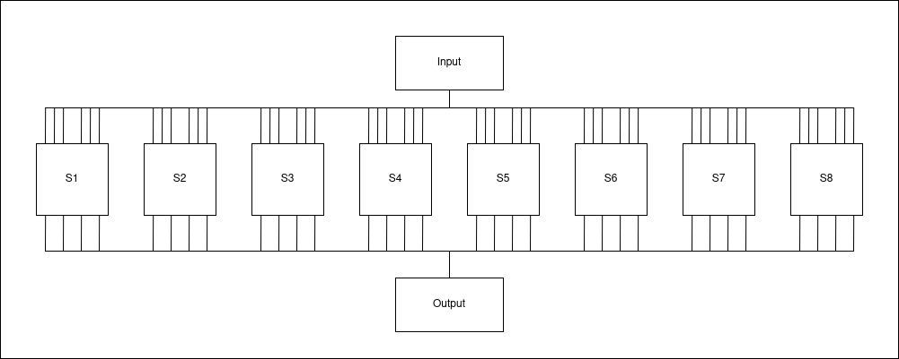

# DES-Light
**Category:** Crypto </br>
**Difficulty:** Medium </br>
**Author:** Nevsor </br>


# Description
> This challenge is similar to Encryption as a Service, designed to teach you some basics about block ciphers and their cryptanalysis.
> 
> Most block ciphers consist of multiple identical rounds. What happens if we only use 2 rounds of DES?

# Summary
The server takes bytes in hex format as input, encrypts them with a random key and sends us the output and the flag encrypted with the same method, therefore it is obvious that the goal of the challenge is to recover the key from our own inputs to decrypt the flag. To encrypt our input, the server uses DES with only two rounds instead of 16.

# Solution
The challenge provides us with the python script running on the server:
```py
#!/usr/bin/env pypy3
import os
import des # https://pypi.org/project/des/

from secret import FLAG


# Shorten DES to only two rounds.
des.core.ROTATES = (1, 1)

key = des.DesKey(os.urandom(8))


def encrypt(plaintext, iv=None):
	ciphertext = key.encrypt(plaintext, padding=True, initial=iv)

	if iv is not None:
		return iv.hex() + ciphertext.hex()
	else:
		return ciphertext.hex()

  
  

def main():
	print("Welcome to the Data Encryption Service.")

	try:
		plaintext = bytes.fromhex(input("Enter some plaintext (hex): "))
	except ValueError:
		print("Please enter a hex string next time.")
		exit(0)
	
	print("Ciphertext:", encrypt(plaintext))
	print("Flag:", encrypt(FLAG.encode("ascii"), iv=os.urandom(8)))

  
  

if __name__ == "__main__":
	main()
```

The script changes the internal variable `des.core.ROTATES` from the `des` library to `(1, 1)`. After some digging in the source code of the library we can see that `des.core.ROTATES` is the table of rotations the key scheduling algorithm uses. In the conventional algorithm, this table is 16 entries long and contains the number of bit-rotations to the left the algorithm does before creating the next subkey. This results in 16 subkeys, each being used for one round of the core des algorithm. Setting `des.core.ROTATES` to `(1, 1)` therefore shortens the encryption to only two rounds, because the key scheduling algorithm produces only two subkeys.

The fact that we can supply our own plaintext and get the ciphertext from the server gives us the opportunity to use a known-plaintext attack to recover the two subkeys we can afterwards use to decrypt the flag.

The main algorithm is a block cipher and always encrypts 64 bit blocks by splitting them up into two 32 bit parts: l and r, encrypts them using the algorithm shown in the following image and puts the encrypted parts L and R back together as the ciphertext of the block. 


(we can ignore all bit-permutations because they are static and we can easily reverse them)

As we can see, we know the blue and red parts and can easily calculate the purple parts of this algorithm, leaving only the input to the feistel function(F) unknown to us.

If we could somehow reverse the feistel function we are able to calculate both K1 and K2.
Taking a look at the inner workings of the feistel function we can see that it uses 8 substitution boxes S1-S8:


Because each substitution box is a 6x4 bit box, each 4 bit block of the output can be produced by 4 four different 6 bit input blocks and therefore we cannot reverse this function directly, but we can calculate all 4 possible values for each 6 bit block of k1 and k2. 

If we would try out all combinations of these values we would only need to try out $4^{16}(2^{32})$ different combinations (this number could certainly be improved further, but there is an easier way in this case), which is much less than the $2^{56}$ we would need to try to bruteforce the key, but it would still take a good amount of time. 

Luckily we can encrypt multiple 64 bit blocks, giving us 4 possible values for each block of k1 and k2 multiple times. Because the server used the same key for every encryption, and we know that our possible values always contain the right part of the key, we can narrow down the possible values of k1 and k2 by only taking the intersection of all values we get. 

If we encrypt multiple 64 bit blocks and use this method, we can narrow down each 6 bit block of k1 and k2 to only one possible value pretty much all the time. Finally we can use k1 and k2 to decrypt the flag.


# Mitigation
Don't use DES.
